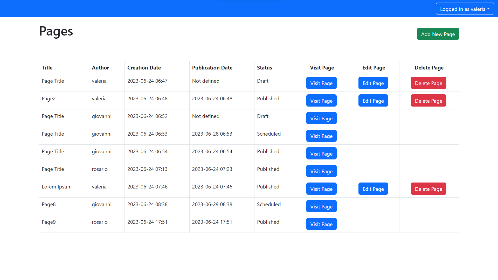
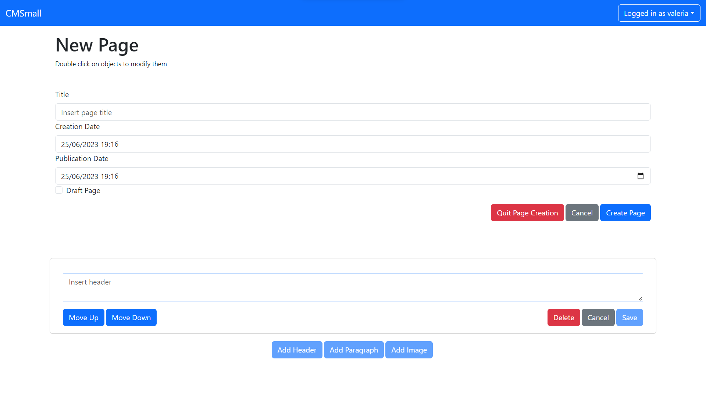

## React Client Application Routes

- Route `/`: contains the table with all the pages accessible from unauthenticated clients, in read only mode. Allows everyone to access to pages.
- Route `/pages/:id`: contains the page contents and properties, everyone can access it, the :id is the unique identifier of the page
- Route `/edit-pages`: contains the table with all the pages and the options to add/edit/delete them. Only authenticated user can access this route and create pages, allows authorized users to delete pages or accessing the editing route. 
- Route `/edit-pages/:id`: contains the page contents and properties, only authenticated and authorized users can access it, allows to modify the page contents and details, the :id is the unique identifier of the page 
- Route `/edit-pages/new`: template for a new page, every authenticated user can access it, allows to create a new page defining details and contents
- Route `/appname`: allows only admin users to edit the app name
- Route `/login`: allows to log into the application
- Route `*`: redirect if path was not found

## API Server

- POST `/api/sessions`
  - Allwows to log in the server
  - Request body: 

  ```
  {
    "email": "email", 
    "password" : "password"
  }
  ```

  - Response 200 OK if success, 401 Unauthorized if email or password are incorrect
  
  - OK response:

  ```
  {
    "id": 1,
    "email": "rosario@test.it",
    "name": "rosario",
    "role": "Admin"
  }
  ```

- GET `/api/session/current`

  - Allows to retrieve the logged in user object 
  - No request parameter (cookies in the request are used)
  - Response 200 OK if success, 401 Unauthorized if request is not authenticated
  - Same Ok response of /api/sessions

- DELETE `/api/session/current`

  - Allows to log out from the server
  - No request parameter (cookies in the request are used)
  - Response 200 OK if success, no body

  
- GET `/api/users`
  - Allows to retrieve all users
  - No request parameter(cookies in the request are used)
  - Response 200 OK if success, 401 Unauthorized if user is not admin, 503 if server error happens
  - Response with a list of user objects
  ```
  [{
    "id": 1,
    "email": "rosario@test.it",
    "name": "rosario",
    "role": "Admin"
  }, ...]
  ```


- POST `/api/appName`
  - Allwows change the app nae
  - Request body: 

  ```
  {
    "name" : "new_name"
  }
  ```

  - Response 200 OK if success, 422 if body.name is not valid, 401 Unauthorized if user is not admin, 503 if server error happens
  

- GET `/api/appName`
  - Allows to retrieve current app name
  - No request parameter
  - Response 200 OK if success, 503 if server error happens
  - Response with the name of the application

- GET `/api/pages`
  - Allows to retrieve all users
  - No request parameter(cookies in the request are used)
  - Response 200 OK if success, 503 if server error happens
  - Response with a list of page objects without the contents
```
[{
    "id": 70,
    "title": "Page Title",
    "author": "valeria",
    "creationDate": "2023-06-24T04:47:22.847Z",
    "publicationDate": null,
    "contents": [],
    "userId": 4
  }, ...]
```

- GET `/api/pages/:id`
  - Allows to retrieve all users
  - No request parameter(cookies in the request are used)
  - Response 200 OK if success, 422 if page id is not valid, 503 if server error happens
  - Response with a list of page objects without the contents
```
[{
    "id": 70,
    "title": "Page Title",
    "author": "valeria",
    "creationDate": "2023-06-24T04:47:22.847Z",
    "publicationDate": null,
    "contents": [],
    "userId": 4
  }, ...]
  ```


- POST `/api/pages`
  - Allwows to add new page
  - Request body: 

```
{
  "title":"Page9",
  "publicationDate":"2023-06-24T15:51:00.000Z",
  "userId":1,
  "contents":[
    {"type":"header","position":0,"editing":false,"value":"Header9"},{"type":"image","position":1,"editing":false,"value":"office"}
    ]
  }
  ```

  - Response 200 OK if success, 422 if body is not valid, 401 Unauthorized if user is not authenticated or set different user if not admin, 503 if server error happens
  - Response is the id of the newly created page

- PATCH `/api/pages/:id`
  - Allwows to edit page details, not content
  - Request parameters is the page we want to modify and request body: 

```
{
  "title":"Page9",
  "publicationDate":"2023-06-24T15:51:00.000Z",
  "userId":1
}
  ```

  - Response 200 OK if success, 422 if body is not valid, 401 Unauthorized if user is not authenticated or set different user if not admin, 503 if server error happens

- DELETE `/api/pages/:id`
  - Allwows to delete a page
  - Request parameters is the page we want to modify 
  - Response 200 OK if success, 422 if body is not valid, 401 Unauthorized if user is not authenticated or does not own the page if not admin, 503 if server error happens


- POST `/api/pages/:pageId`
  - Allwows to add new content to page
  - Request parameter is the page to which to add the content and request body:

```
{
  "type":"header",
  "position":0,
  "value":"Header9"
}
  ```
  - Response 200 OK if success, 422 if body is not valid or page not found, 401 Unauthorized if user is not authenticated or does not own the page, 503 if server error happens

- PUT `/api/pages/:pageId/content/:contentId`
  - Allwows to add new content to page
  - Request parameter pageId is the page of the content and contentId is the content to modify , request body:

```
{
  "type":"header",
  "position":0,
  "value":"Header9"
}
  ```
  - Response 200 OK if success, 422 if body is not valid or page or content not found, 401 Unauthorized if user is not authenticated or does not own the page, 503 if server error happens

- DELETE `/api/pages/:pageId/content/:contentId`
  - Allwows to delete a contet of a page
  - Request parameters are contentId, the  id of content to delete and pageId, the page id of its page
  - Response 200 OK if success, 422 if body is not valid, 401 Unauthorized if user is not authenticated or does not own the page if not admin, 503 if server error happens


## Database Tables

- Table `users` - contains user entities, composed by id as pk, name, role, email, password (hashed), salt 
- Table `page` - contains page entities, composed by id as pk, title, creationDate, publicationDate and userId, as foreign key referring to user.id
- Table `content` - contains content entities, composed by id as pk, type, position, value and pageId, as foreign key referring to page.id
- Table `app_status` - contains app status entities, composed by id as pk and name of the application (the latest is the valid one)

## Main React Components


- `PageTableComponent` (in `PageTableComponent.jsx`): table of all the available pages, showed in editing mode or read only mode depending of the route.
Allows to access the full crud operations over a page.
  - `PageTableRow` (in `PageTableComponent.jsx`): row of the PageTable list, has buttons to access operation on existing content 

- `PageComponent` (in `PageComponent.jsx`): shows all the informations of a page, allows editing mode or read only mode depending on the route. Keeps the information of the page and modify passing other components values and handles. Allows also for the creation of a new page (since structure is almost identical, just some logic changes)
  - `HeaderEditor, ParagraphEditor, ImageEditor` (in `PageComponent.jsx`): cards that contain the components editor interfaces
  
  - `PageEditor` (in `PageComponent.jsx`): page properties editor interface, can allows to save the page properties edited or to save the whole page if new page is created (through handles supplied by PageComponent).


- `AuthComponent` (in `AuthComponent.jsx`): login interface, handles supplied by NavBar component
- `AppNameComponent` (in `AppNameComponent.jsx`): change name interface

- `NavBar` (in `NavbarComponent.jsx`): navbar shown in every route, allows to go to '/' clicking the app name, and to go to all the allowed authenticated routes, log out and log in


- `App` (in `App.jsx`): main component, has the router and the callbacks for authentication and retrieving app name, set the logged in user as context 


## Screenshot





## Users Credentials

- rosario : admin user
  - email: rosario@test.it 
  - password: password
- saro : no pages regular user
  - email: saro@test.it 
  - password: password_saro
- giovanni: regular user
  - email: giovanni@test.it 
  - password: password_giovanni
- valeria: regular user
  - email: valeria@test.it 
  - password: password_valeria
